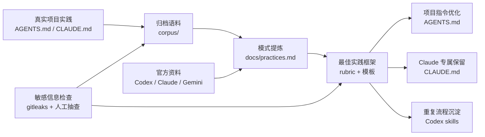
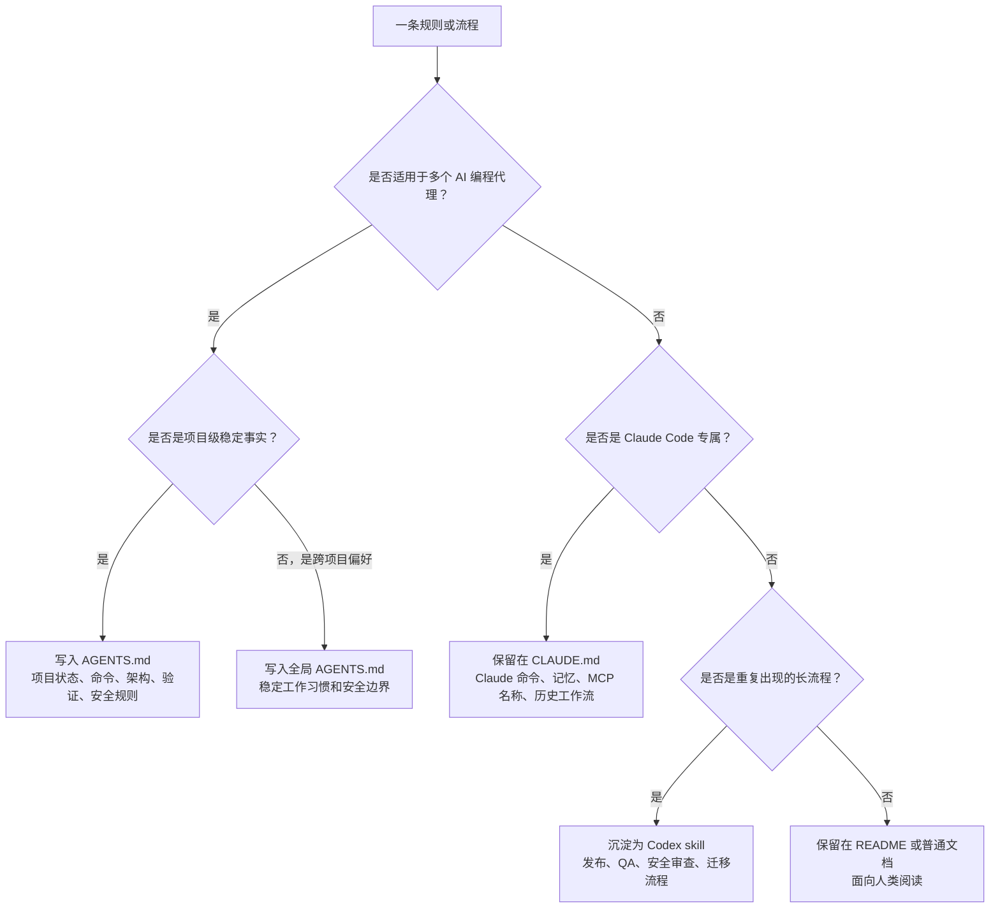
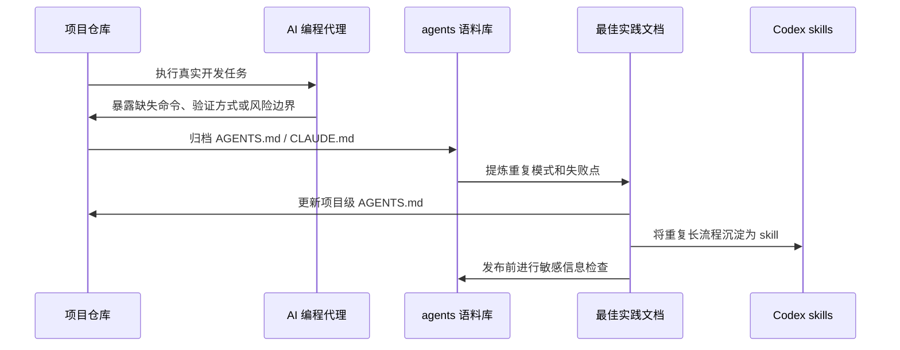

# Agents

这个仓库用于沉淀 `AGENTS.md`、`CLAUDE.md` 和其他 AI 编程代理指令文件的实践经验。

它不是单纯的文件归档，而是一个持续演进的最佳实践知识库：从真实项目里的 `AGENTS.md` / `CLAUDE.md` 提取有效模式，再结合 Codex、Claude Code、Gemini CLI 等工具的官方资料，整理出可复用、可审查、可迁移的项目指令方法。

## 项目目标

- 归档真实项目中的 `AGENTS.md` 和 `CLAUDE.md`，保留来源路径，方便回溯。
- 总结哪些指令对 AI 编程代理真正有帮助，哪些只是噪音。
- 形成可复用的项目指令模板、迁移指南和评分标准。
- 比较 Codex、Claude Code、Gemini CLI 等工具的上下文/记忆机制，提炼跨工具通用做法。
- 把重复出现的长流程沉淀为 Codex skills，而不是塞进每个项目的 `AGENTS.md`。
- 在发布和再生成语料前持续做敏感信息检查。

## 整体图示

这个仓库的核心路径是：从真实项目经验出发，经过清洗、归纳、对照资料和审查，沉淀为可复用的指令模板与工作流。



指令文件的分工可以按下面的判断方式处理：



最佳实践不是一次性写完，而是通过真实任务持续改进：



## 目录结构

| 路径 | 说明 |
| --- | --- |
| `corpus/agents/` | 归档的 `AGENTS.md` 文件，保留原始项目路径。 |
| `corpus/claude/` | 归档的 `CLAUDE.md` 文件，保留原始项目路径。 |
| `manifests/files.json` | 归档文件的结构化清单。 |
| `manifests/files.csv` | 适合表格分析的归档清单。 |
| `docs/practices.md` | 从本地实践中提炼出的实用模式。 |
| `docs/best-practice-framework.md` | 推荐结构、评分标准和持续优化流程。 |
| `docs/external-research.md` | Codex、Claude Code、Gemini CLI 等外部资料笔记。 |
| `docs/migration-guide.md` | 将稳定的 `CLAUDE.md` 内容迁移到 `AGENTS.md` 的指南。 |
| `docs/patterns/` | 可复用的 `AGENTS.md` 模板。 |
| `docs/goals/` | 可长期执行、可恢复、可验证的 Codex goal 指令文件。 |
| `docs/source-workspace-agents-index.md` | 来源工作区的 agents 文件索引和迁移候选。 |

## 当前快照

- 已归档 `AGENTS.md`：105 个
- 已归档 `CLAUDE.md`：49 个
- 来源工作区：`/Users/kevinten/projects`
- 已排除临时 `.claude/worktrees` 快照

## 核心原则

1. `AGENTS.md` 是跨工具、跨代理的项目指令入口，应该记录稳定规则、真实命令、架构边界和验证方式。
2. `CLAUDE.md` 适合保留 Claude Code 特有的记忆、命令、MCP 名称和历史工作流；稳定的跨工具内容应迁移到 `AGENTS.md`。
3. 全局规则要短、稳定、可复用；项目命令和项目风险要放在离代码最近的项目级 `AGENTS.md` 中。
4. 不要为了统一而集中管理所有项目命令。命令只适用于某个仓库时，就应该留在那个仓库的指令文件里。
5. 不要编造构建、测试、部署命令。参考仓库、归档仓库可以只有很薄的说明。
6. 不要提交或展示 secrets、`.env` 值、token、cookie、私钥或个人凭据。
7. 优先从真实项目实践中总结，再用官方文档补齐机制和边界。
8. 当代理在真实任务中重复犯错、重复查找命令或误判项目状态时，及时更新指令文件。

## 推荐读取顺序

代理进入项目后，建议按这个顺序理解上下文：

1. 读取工作区或仓库根目录的 `AGENTS.md`。
2. 读取当前项目或子包中距离代码最近的 `AGENTS.md`。
3. 如果没有 `AGENTS.md`，再读取 `CLAUDE.md` 作为迁移来源或历史上下文。
4. 读取 `README.md`、脚本文件、包管理配置和本地工具配置，验证指令是否仍然准确。

## 最佳实践工作流

1. 从 `corpus/` 中挖掘重复出现的有效章节、失败点和项目类型。
2. 对照 Codex、Claude Code、Gemini CLI 等官方资料，确认上下文加载、记忆和 skill 机制。
3. 将稳定、跨工具、项目级的规则沉淀到 `AGENTS.md`。
4. 将 Claude 专属内容继续保留在 `CLAUDE.md`，避免把工具特定细节误写成通用规则。
5. 将重复出现的长流程沉淀为 Codex skills。
6. 用 `docs/best-practice-framework.md` 的 rubric 审查每个指令文件是否足够清晰、可执行、安全。
7. 每次发布或重新生成语料前，先做敏感信息扫描。

## 语料说明

这个仓库故意保留了一些很短的 `AGENTS.md`。对于参考资料、归档项目、历史实验或没有活跃运行时的仓库，薄指令是正确的：它能提醒代理保留历史，不要擅自补造构建、测试或部署流程。

活跃产品类项目的指令通常更完整，会包含：

- 项目状态
- 编辑前检查
- 常用命令
- 环境变量处理规则
- 部署说明
- 验证要求
- 已知风险和常见坑

## 维护方式

重新生成语料或发布前，必须先做敏感信息检查。

```bash
gitleaks dir . --no-banner --redact
```

建议的维护节奏：

- 新增或更新项目指令后，同步更新 `manifests/`。
- 发现某类问题重复出现时，先更新 `docs/practices.md` 或 `docs/best-practice-framework.md`。
- 某个流程在多个项目中重复出现时，优先考虑沉淀为 skill。
- 对外分享前，检查 `corpus/` 中是否有私有路径、内部链接、密钥形态字符串或不应公开的业务信息。

## 参考资料

- [OpenAI Codex: Custom instructions with AGENTS.md](https://developers.openai.com/codex/guides/agents-md)
- [OpenAI Codex: Agent Skills](https://developers.openai.com/codex/skills)
- [AGENTS.md format](https://agents.md/)
- [Anthropic Claude Code: Memory](https://docs.anthropic.com/en/docs/claude-code/memory)
- [Gemini CLI: Provide Context with GEMINI.md Files](https://google-gemini.github.io/gemini-cli/docs/cli/gemini-md.html)
